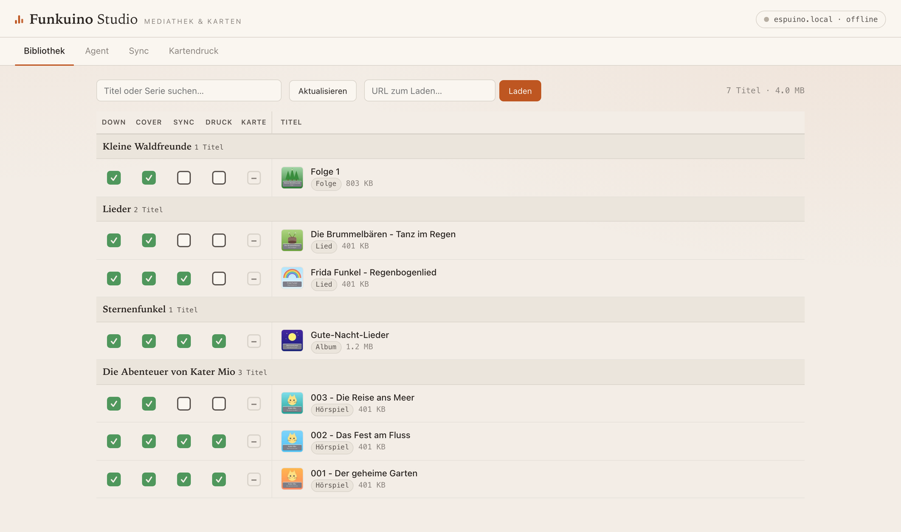
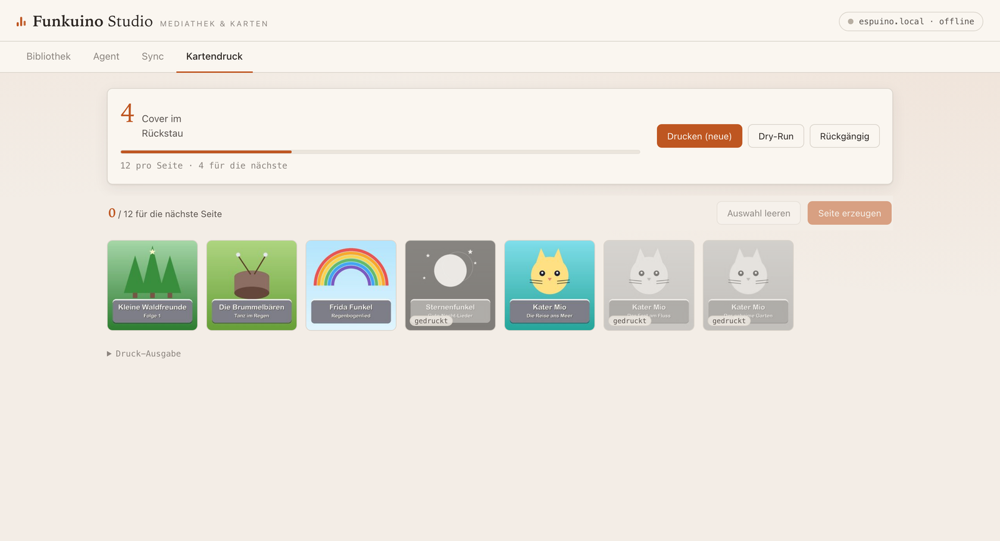

# Funkuino

**Manage an [ESPuino](https://espuino.de) kids' audio player from your Mac —
library mirroring, printable RFID cards, and a web dashboard with an embedded
Claude agent.**

The [ESPuino](https://forum.espuino.de) is a wonderful DIY, RFID-controlled
audio player for children: put a card on the box, the story plays. What it
doesn't come with is comfortable tooling for the grown-up side of the workflow —
getting audio onto the device, keeping a library organised, and producing the
physical cards. Funkuino is that missing half: a set of small, sharp
command-line tools plus one local web app that ties them together.



*Screenshots show a fictional demo library.*

## Features

- **`./sync` — rsync-style mirror to the device.** One-way mirror of a local
  `files/` folder to the ESPuino over its HTTP API. Fast recursive listing,
  change detection via a local manifest (the device can't report file sizes
  cheaply), crash-safe incremental state (an interrupted upload is never
  trusted), size-scaled timeouts for big audiobook files, `--delete` with
  guard rails, automatic NFC/NFD Unicode normalisation (macOS vs. device), and
  per-device manifests keyed by MAC address — mirror the same library to two
  ESPuinos without confusion.
- **`./download` — audio intake in the library's conventions.** A yt-dlp
  wrapper that lands audio as your library expects it: songs, albums with
  ordered track numbers, or audiobooks (Hörspiele) — multi-part episodes merged
  into a single MP3 with a spoken title intro (macOS `say`), correct tags, and
  the full-resolution title image saved separately for card printing (covers
  are deliberately *not* embedded in the audio: the device has no display and a
  large leading ID3 tag makes playback start-stutter).
- **`./prepare` / `./covers`** — the audiobook merge as a standalone tool, and
  batch extraction of embedded cover art from an existing library.
- **`./cards` — printable RFID card sheets.** Lays title images out as
  edge-to-edge 6×6 cm squares on A4 PDFs (12 per page) with cut tick marks in
  the margins. Print, stick an RFID tag on each card's back, laminate, cut. A
  print manifest makes a bare `./cards` mean "everything new since last time",
  with stackable `--undo`.
- **`./cards-ui` — visual card picker.** A localhost web app showing every
  cover as a thumbnail (newest first, printed ones greyed out); hand-pick
  covers onto a sheet, or one-click the oldest full page.
- **`./studio` — Funkuino Studio.** One local web app for the whole workflow
  (see below).

## Funkuino Studio

`./studio` opens a dashboard covering the entire pipeline per card — Download ·
Cover · Sync · Print · RFID — where the status boxes are also the actions:
click a unit's sync box to upload it, select covers for printing via a floating
print bar, assign RFID cards straight from the library view.

- **Live RFID assignment:** Studio keeps a passive websocket to the device and
  hears every card placement. Put an unknown card on the box, click the row it
  should belong to — assigned (with sensible play-mode defaults per content
  type).
- **Integrated card printing** with the same manifest and `--undo` semantics as
  `./cards`:



- **Embedded Claude agent** (optional, [Claude Agent
  SDK](https://docs.anthropic.com/en/api/agent-sdk/overview)): paste a URL into
  the library tab and an agent session handles the intake — probe, classify
  (song/album/audiobook), download with the right flags, verify naming and
  covers, report back — asking *you* whenever a judgment call is needed
  (episode numbering, attribution, intro wording), via question cards in the
  browser. Permission model: read-only tools and the repo's wrappers are
  auto-allowed, risky commands always raise an approval card. Requires a
  subscription token in `.env` (`SDK_TOKEN=…` from `claude setup-token`).

## Quickstart

```bash
git clone https://github.com/sadilek/Funkuino.git
cd Funkuino
python3 -m venv .venv && .venv/bin/pip install -r requirements.txt

./sync --dry-run        # see what would be uploaded (files/ -> device)
./sync                  # mirror files/ to espuino.local
./cards                 # lay out new cover images as a printable PDF
./studio                # open the dashboard at http://127.0.0.1:8800
```

Requirements: Python ≥ 3.11, **ffmpeg** on PATH, macOS for the spoken
audiobook intros (`say`) — everything else works cross-platform in principle
but is developed and tested on macOS. Python dependencies (yt-dlp, Pillow,
aiohttp, …) come from `requirements.txt`.

Configuration: CLI flags > `ESPUINO_*` env vars > defaults (`ESPUINO_HOST`,
`ESPUINO_LOCAL_DIR`, `ESPUINO_REMOTE_ROOT`, `ESPUINO_HTTP_USER`/`_PASSWORD`).

## Library conventions

One RFID card = one *unit* of content, derived from file layout alone — no
database:

| Unit | Layout |
|------|--------|
| Song | `files/Lieder/<Artist> - <Title>.mp3` |
| Album | `files/<Artist> - <Album>/<NN> <Title>.mp3` |
| Audiobook episode | `files/<Series>/<NNN> - <Title>.mp3` (one merged file) |
| Multi-story episode | `files/<Series>/Folge <N>/<NN> <Story>.mp3` (folder = card, stories navigable with prev/next) |

Cover images mirror the same paths under `card-covers/` (one image per card).

## Hard-won device knowledge

`CLAUDE.md` documents the ESPuino's HTTP API and a collection of quirks that
took real debugging to learn — mDNS resolution cost, SD-writer wedging, why
FTP is useless for diffing, NFC/NFD filename mismatches, and a full root-cause
analysis of the PN5180 "resting card briefly lost during playback" problem
(fixed upstream in ESPuino PR #444). If you script against an ESPuino, read it
before relearning any of this the hard way.

## A note on content

`./download` is a thin convenience wrapper around
[yt-dlp](https://github.com/yt-dlp/yt-dlp) that organises audio into the
library conventions above. Only download content you are entitled to download.

## Credits & license

Built around the excellent [ESPuino](https://github.com/biologist79/ESPuino) by
biologist79 and contributors. Funkuino itself is [MIT-licensed](LICENSE).
